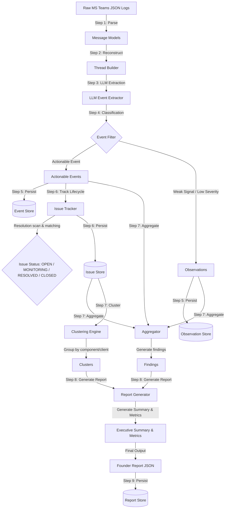

# 🛠️ Organizational Intelligence Extraction Pipeline

> [!IMPORTANT]
> **PROJECT STATUS: CLOSED**  
> This project has been successfully completed and is now closed as all learning and prototyping objectives have been fully fulfilled. No further updates or active development are planned.

The **Organizational Intelligence Extraction Pipeline** is an advanced, state-of-the-art backend framework designed to ingest raw message logs (e.g., Microsoft Teams or Slack exported dialogue), reconstruct them into contextual conversation threads, extract actionable events and weak signals via Local LLMs (Ollama) or cloud models (OpenAI), manage issue lifecycles statefully, and generate structured, founder-level intelligence reports.

Its primary goal is to **reduce noise** (filtering out chit-chat, routine status updates, and social alerts) and **surface critical risks, operational incidents, and key organizational insights** that require leadership or founder-level intervention.

---

## 🏗️ System Architecture

The pipeline processes data through a structured, multi-layer, deterministic-and-generative workflow. 



---

## 🗂️ Project Directory Structure

```text
org-intelligence-extraction/
├── config.py              # Single source of truth for configuration & parameters
├── run.py                 # Main orchestrator script to run a single day's pipeline
├── run_all.py             # Batch script to run the pipeline sequentially over all raw files
├── requirements.txt       # Core dependencies (openai, ollama, pydantic, pytest)
├── domain/                # Shared domain logic and data models
│   ├── enums.py           # Core enums (IssueStatus, RelevanceLevel, FounderAttention, etc.)
│   ├── models.py          # Pydantic v2 schemas representing Messages, Events, Issues, etc.
│   └── schemas.py         # Structural shapes for data validation
├── pipeline/              # Individual steps of the processing pipeline
│   ├── thread_builder.py       # Rebuilds chronological reply-chains from Graph API JSONs
│   ├── event_extractor.py      # LLM-based parsing of threads to extract raw signal models
│   ├── event_filter.py         # Rule-based noise filtration and actionable-event promotion
│   ├── issue_tracker.py        # Manages issue state, history logs, and days open tracking
│   ├── resolution_detector.py  # Message & keyword-based verification of resolved tickets
│   ├── founder_classifier.py   # Maps issues/events to strategic founder impact classes
│   ├── aggregator.py           # Synthesizes cross-day trends and observation findings
│   ├── clustering.py           # Combines related issues into higher-level root clusters
│   ├── org_intelligence.py     # Pinpoints team bottlenecks and knowledge concentrations
│   └── report_generator.py     # Assembles final curated reports with specific recommendations
├── storage/               # Atomic JSON-based local data stores
│   ├── event_store.py
│   ├── observation_store.py
│   ├── issue_store.py
│   ├── cluster_store.py
│   ├── report_store.py
│   └── cluster_registry.py
├── prompts/               # Context-engineered LLM instruction templates
│   ├── event_extraction.txt
│   ├── cluster_discovery.txt
│   └── executive_summary.txt
├── data/                  # Workspace data inputs and internal intermediary caches
│   ├── raw/               # Raw input MS Teams dialogue JSON files
│   └── processed/         # Reconstructed thread JSON outputs
├── outputs/               # Pipeline execution results organized by run dates
│   ├── events/            # Daily actionable events
│   ├── observations/      # Daily weak signal observations
│   ├── issues/            # Master list of tracked issues
│   ├── clusters/          # Master list of issue clusters
│   └── reports/           # Structured Founder Report JSON outputs
├── utils/                 # General helpers
│   ├── date_utils.py      # Iso-date parser and date formatter
│   └── text_utils.py      # Keyword tokenization and regex helpers
└── tests/                 # Comprehensive Pytest test suite
```

---

## ⚙️ Core Technical Layers

### 1. Reconstructed Threads (`pipeline/thread_builder.py`)
In conversations, messages arrive sequentially but belong to branching reply trees. The `ThreadBuilder` reconstructs root-reply structures from flat MS Graph API lists using metadata like `replyToId`, forming logically unified chat blocks.

### 2. LLM Signal Extraction (`pipeline/event_extractor.py`)
Using context-engineered prompt templates (loaded via `prompts/`), the pipeline prompts an LLM (Ollama's `llama3.1:8b-instruct` or OpenAI's `gpt-4o`) to evaluate reconstructed threads. The LLM extracts potential incidents, including affected areas, entities (like Paytm, Redis, or specific client names), participants, and severity.

### 3. Smart Noise Gates & Filtering (`pipeline/event_filter.py`)
To prevent the LLM's enthusiasm from flooding the system with irrelevant logs:
* **Social Noise Filter**: Discards logs matching `NOISE_KEYWORDS` (e.g., lunch arrangements, cricket discussions, birthday wishes).
* **Weak Signal Isolation**: Non-critical events are classified as **Observations** rather than Actionable Events. Observations are accumulated silently to identify slow-burning process issues.

### 4. Stateful Issue Tracker (`pipeline/issue_tracker.py`)
Actionable Events promote into a state machine that tracks issues across multiple runs:
* **Lifecycle States**: Issues transition dynamically: `OPEN` $\rightarrow$ `MONITORING` $\rightarrow$ `RESOLVED` $\rightarrow$ `CLOSED`.
* **Resolution Pass**: Before updating, the tracker scans message logs for resolving indicators (e.g., *"patch deployed successfully"*). If a resolution is detected and entities overlap, the issue moves to `RESOLVED` (and eventually auto-closes after 7 days).
* **Escalation**: Open issues are automatically bumped in priority (e.g., escalating from `TEAM` to `LEADERSHIP` or `FOUNDER`) if they remain unresolved for 3+ days.

### 5. Founder Classification Engine (`pipeline/founder_classifier.py`)
Events are analyzed deterministically against strategic categories to assign relevance (`NOISE`, `TEAM`, `LEADERSHIP`, `FOUNDER`) and attention ratings (`FYI`, `MONITOR_REQ`, `ACTION_REQUIRED`, `IMMEDIATE_ACTION`):
* **Revenue Risk**: Issues affecting gateway transactions, subscription pricing, billing engines.
* **Customer Risk**: Client complaints, SLA breaches, direct client escalations.
* **Delivery Risk**: Blocked deployments, release delays, continuous build failures.
* **Operational Risk**: Production outages, database lockups, hosting latency spikes.

### 6. Cluster & Personnel Bottlenecks (`pipeline/clustering.py`, `pipeline/org_intelligence.py`)
* **Root-Cause Clustering**: Merges distinct bugs into high-level root causes (e.g., grouping several login issues under an "Android App Proguard" cluster) to make it easier for leadership to understand the scope of the problem.
* **DRI & Personnel Analysis**: Monitors names within conversation chains to identify overloaded engineers (e.g., if a developer is a single point of failure in 80% of critical incidents) and map knowledge concentrations.

### 7. Executive Summarizer & Report Generator (`pipeline/report_generator.py`)
Generates a structured daily report for the founder:
* An **Executive Summary** describing the operational status of the company.
* A prioritized list of **Critical Actionables** with explicit recommended actions.
* Highlights of **Recently Resolved Issues** from the last 7 days.
* Key system metrics (e.g., raw signals processed vs. actionable items escalated).

---

## 🚀 Execution & Usage Guide

### Prerequisites
* Python 3.10+
* Local Ollama instance installed and running (`ollama run llama3.1:8b-instruct`), or an OpenAI API Key configured in your environment.

### Installation
1. Clone the repository and navigate to the project directory:
   ```bash
   git clone <repository_url>
   cd org-intelligence-extraction
   ```
2. Set up a virtual environment and install the required dependencies:
   ```bash
   python -m venv venv
   source venv/bin/activate  # On Windows: venv\Scripts\activate
   pip install -r requirements.txt
   ```

### Running the Pipeline
You can run the pipeline for a single day, or process your entire history in batch.

#### A. Run a Single Day
Execute the orchestrator:
```bash
python run.py
```
This will print a list of available raw conversation files in `data/raw/` and prompt you to select one to analyze. Alternatively, run a specific file directly:
```bash
python run.py 11-06-2026.json
```

#### B. Batch Run All Days Chronologically
To run the entire chronological timeline (e.g., simulating days of conversations to let the issue tracker transition states and escalate issues over time), execute:
```bash
python run_all.py
```
This script will clean the previous outputs directory and process every raw JSON file sequentially, writing the daily founder reports to `outputs/reports/`.

---

## 🧪 Testing

The codebase includes an extensive Pytest suite validating state machines, normalizers, filters, and report generation logic.

Run the test suite:
```bash
python -m pytest tests/ -v
```

---

## 🔮 Future Possible Scope

While this project is closed as a learning prototype, it serves as a foundation for a production-grade enterprise organizational intelligence platform. Potential areas of expansion include:

### 1. Real-Time Streaming & Native Integrations
* **Ingestion Webhooks**: Create active webhooks subscribing to Slack, Microsoft Teams, Discord, Zoom, or Google Chat Events rather than parsing static JSON exports.
* **Message Kafka Queue**: Implement streaming message ingestion (using Apache Kafka or AWS Kinesis) to handle high-volume chat streams across large organizations with thousands of employees.

### 2. Multi-Modal Analysis
* **Contextual Attachments**: Parse attached files (PDFs, text files, Excel spreadsheets) and screen captures uploaded in chat channels to extract context for issues.
* **Audio Transcriptions**: Ingest recorded standup meetings, team syncs, and emergency war-room recordings via OpenAI Whisper to extract commitments, issues, and resolutions automatically.

### 3. Bidirectional Integration with Ticketing Platforms
* **Jira / GitHub / Linear Sync**: Connect the pipeline to your engineering issue trackers. When a conversation resolves a problem, the pipeline could automatically close the corresponding Jira ticket or GitHub issue, or create tickets for new issues detected in chat.
* **DRI Auto-Assigner**: Pull Git blame data, file ownership, and pull request history to automatically assign a Direct Responsible Individual (DRI) to new issues surfaced in chat.

### 4. Advanced Intelligence & Retrieval (RAG)
* **Historical Issue Database**: Store all historical issues as high-dimensional vector embeddings in a vector database (e.g., Pinecone, Milvus, or Qdrant). When a new issue arises, the system can retrieve similar historical incidents and show how they were resolved in the past.
* **Natural Language Q&A**: Provide an interactive interface where founders can ask questions like *"What was the root cause of our payment failure last week?"* or *"Is Siddharth currently blocked by anyone?"*

### 5. Advanced Organizational Network Graphing
* **Interaction Mapping**: Generate interaction network graphs to visualize communication patterns and detect siloed teams or bottlenecked individuals.
* **Sentiment & Morale Trends**: Aggregate sentiment scores across teams to identify burnout trends, communication friction, or drops in team morale before they lead to attrition.

### 6. Security, GDPR & Enterprise Compliance
* **PII Redaction**: Redact personally identifiable information (PII) like phone numbers, addresses, credit cards, or passwords at the ingestion boundary to comply with GDPR, CCPA, and HIPAA regulations.
* **Role-Based Access Control (RBAC)**: Implement secure authentication and permissions separating what a Founder can see (strategic metrics, revenue impact) from what an Engineering Lead can see (technical logs, individual developer assignments).
